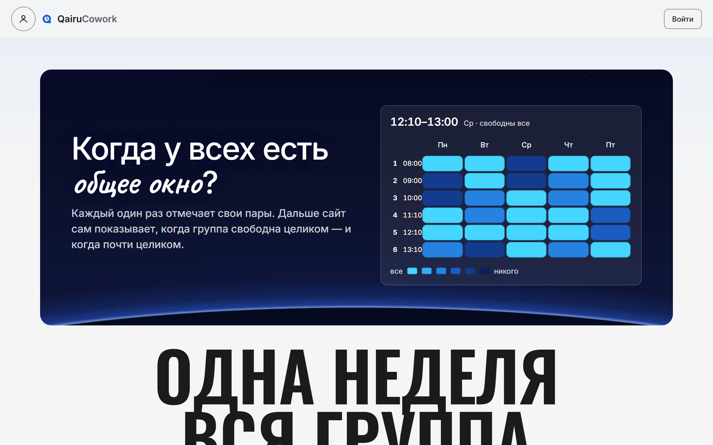
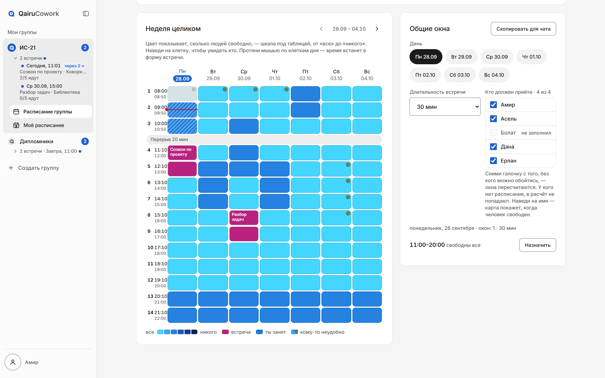
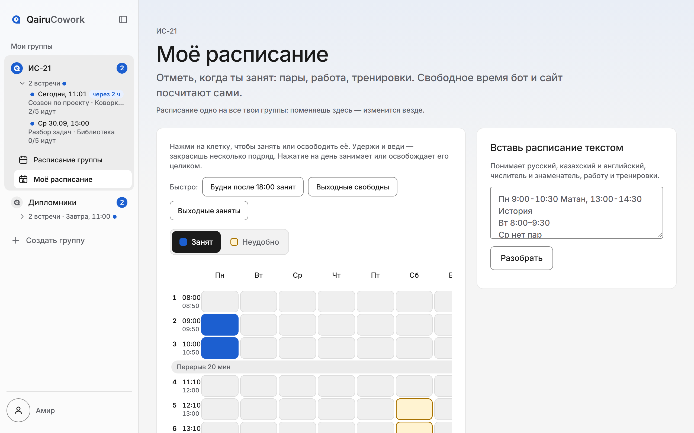
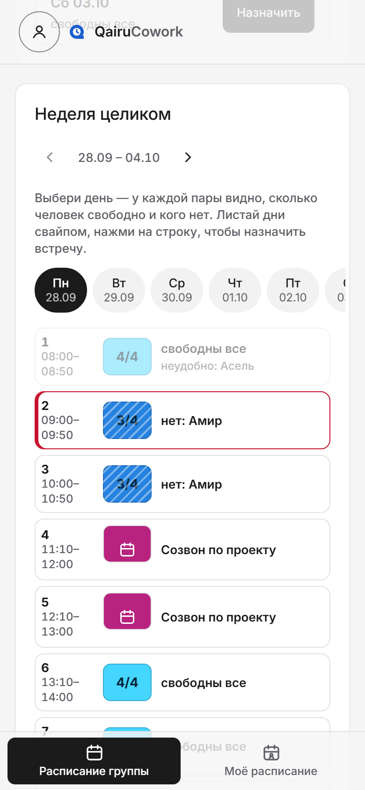
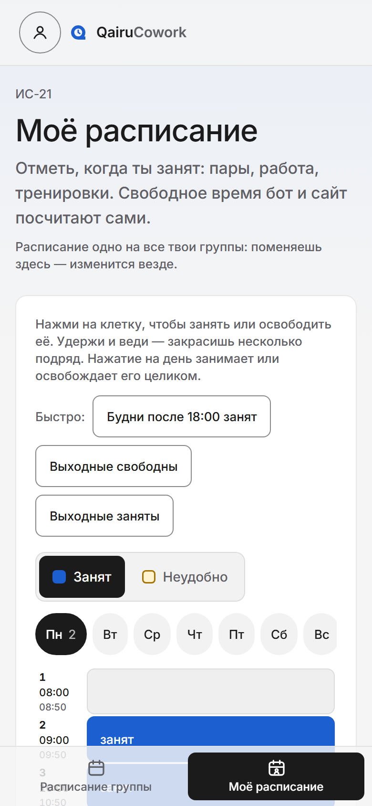

# QairuCowork

**[Открыть сайт](https://qairu-cowork.vercel.app)** · **[Бот @QairuCoworkbot](https://t.me/QairuCoworkbot)** ·
[](https://github.com/wypas0/qairu-cowork/actions/workflows/ci.yml)

Находит **общие свободные окна** у студентов из одной группы и помогает договориться о встрече.
Работает двумя лицами одного продукта: **сайт** и **телеграм-бот** — общая база, общее ядро расчёта.



Стек: Next.js 16 (App Router) · TypeScript · Drizzle ORM · PostgreSQL (Supabase) · Vitest · Playwright
Языки интерфейса: 🇷🇺 русский · 🇰🇿 қазақша · 🇬🇧 english


---

## Как начать

1. Открой [@QairuCoworkbot](https://t.me/QairuCoworkbot) и нажми `/start` — сайт откроется прямо в Telegram,
   входить не нужно. В обычном браузере — [qairu-cowork.vercel.app](https://qairu-cowork.vercel.app),
   кнопка «Войти через Telegram» и подтверждение в боте.
2. Староста нажимает «Создать группу» и зовёт одногруппников ссылкой или QR-кодом. Можно и из чата:
   добавить бота в чат группы и написать `/setup`.
3. Каждый один раз отмечает свою занятость в «Моём расписании»: клетками, текстом или скриншотом расписания.
4. Карта недели показывает, когда свободны все. «Назначить» — и бот разошлёт приглашения, соберёт ответы
   и напомнит перед встречей.

## Что это

Каждый **один раз** отмечает, когда он занят — парами, работой, тренировками. Дальше:

- **на сайте**: карта недели, где цветом видно, сколько человек свободно в каждую пару. Наведи на имя —
  карта покажет, когда этот человек свободен; протяни мышью по клеткам дня — время встанет в форму встречи;
  на телефоне — один день крупными строками, дни листаются свайпом. «Лучшее время», общие окна с кнопкой
  «Скопировать для чата», встречи с ответами, итогами и кнопкой «Повторить»; по карте и по сетке
  расписания можно ходить стрелками;
- **в своём расписании**: пары и работа («занят») и «неудобно» — могу, но лучше не надо; такие окна
  предлагаются последними. На телефоне — по одному дню крупными клетками. Можно подключить личный
  календарь по ссылке .ics — занятость подтянется сама;
- **в чате**: `/free` показывает общие окна, `/meeting` назначает встречу с опросом; бот
  напоминает о встречах, присылает итоги и предупреждает, если встреча легла на занятое время.

Расписание принадлежит человеку, а не чату: одно на все его группы — поправил в одной, изменилось везде.

## Как это выглядит





| Карта недели на телефоне | Своё расписание на телефоне |
|---|---|
|  |  |

## Команды бота

Бот прежде всего присылает уведомления: напомнить заполнить расписание, приглашения на встречи
(отвечать можно прямо кнопками), ответы участников, напоминание перед началом. Расписание, разовая
занятость и настройки группы — на сайте; старые команды (`/schedule`, `/busy`, `/settings` и другие)
отвечают кнопкой туда.

**В личке**

| Команда | Что делает |
|---|---|
| `/start` | открыть сайт |
| `/lang` | язык |
| `/help` | справка |
| код группы | прислать боту — добавит в группу |

**В группе**

| Команда | Что делает |
|---|---|
| `/setup` | подключить чат (админ) |
| `/join` | добавить себя в участники |
| `/members` | кто заполнил расписание, кто нет |
| `/free` | общие окна всех участников на неделю |
| `/free @asel @nurbek` | окна только с этими людьми |
| `/free 90` | окна не короче 90 минут |
| `/free 80%` · `q5` | кворум: свободны 80% участников / хотя бы 5 человек |
| `/meeting` | назначить встречу с опросом, напоминанием и выгрузкой в календарь |
| `/remind` | напомнить незаполнившим одним сообщением (админ) |
| `/link` | открыть группу на сайте |
| `/lang` | язык бота в чате (админ) |


## Страницы сайта

| Адрес | Что там |
|---|---|
| `/` | о продукте, вход через Telegram, свои группы |
| `/g/{slug}` | карта недели, общие окна, встречи, участники, настройки |
| `/g/{slug}/me` | своя сетка («занят» и «неудобно»), расписание текстом или с фото, разовая занятость, личный календарь |
| `/g/{slug}/join` | вход по ссылке-приглашению |
| `/g/{slug}/qr` | QR-код приглашения на весь экран — для проектора в аудитории |
| `/g/{slug}/meetings/{id}.ics` | встреча файлом для календаря |

**Паролей нет — вход только через Telegram.** Внутри Telegram сайт открывается кнопкой бота и узнаёт
человека по подписанному `initData`; в браузере — кнопка «Войти через Telegram» и подтверждение в боте.
Поэтому пользователь сайта и пользователь бота — один и тот же человек.

---

## Формат расписания

Поле «Вставь расписание текстом» в «Моём расписании» понимает:

```
Пн 9:00-10:30 Матан, 13:00-14:30 История
Вт 8:00–9:30
Ср нет пар
Чт 10-11.30; 12:00-13:30 Физика
Пт 9:00-10:30 Алгебра (числитель), 9:00-10:30 Физика (знаменатель)
Сб 18:00-22:00 работа
Жұма 9:00-10:30
Friday 15:00-16:00
```

Дни на трёх языках (полные и сокращённые), разделители `-` `–` `—` `до` `to`, время `9`, `9:00`,
`9.00`, `09-00`, несколько диапазонов через `,` и `;`, слова «нет пар / бос / free»,
«ежедневно / күнде / daily», чётность недель, типы занятости (работа, спорт, экзамен).
CSV: `weekday,start,end,label,parity`.

Чтобы заработала чётность, староста задаёт «Начало семестра» в настройках группы. Без этой даты пары
«через неделю» **не учитываются** — сайт не угадывает, какая неделя сейчас.

Экзамены, сессии и поездки — «Разовая занятость» там же, в «Моём расписании»: дата, период или «весь день».

---

## Собрать и запустить

Нужен Node.js 22+. Посмотреть сайт у себя без Supabase и Telegram:

```bash
npm install
npx next build
node scripts/dev/e2e-server.mjs 3200
```

Скрипт поднимает Postgres в памяти (PGlite), заводит демо-группу «ИС-21» с пятью участниками и встречами
и запускает сайт на <http://localhost:3200>. Войти: в консоли браузера выполнить
`document.cookie = "qairu_token=<токен из терминала>; path=/"` и открыть `/g/smoke001`.

Проверки — те же, что гоняет CI на каждый пуш:

```bash
npm run typecheck && npm run lint && npm test && npm run e2e
```

Свой экземпляр с базой в Supabase, сайтом на Vercel и ботом — пошагово в **[DEPLOY.md](DEPLOY.md)**.
Для локальной сборки используй `npx next build`: `npm run build` дополнительно сверяет схему базы и
регистрирует вебхук бота из `BOT_TOKEN`.
